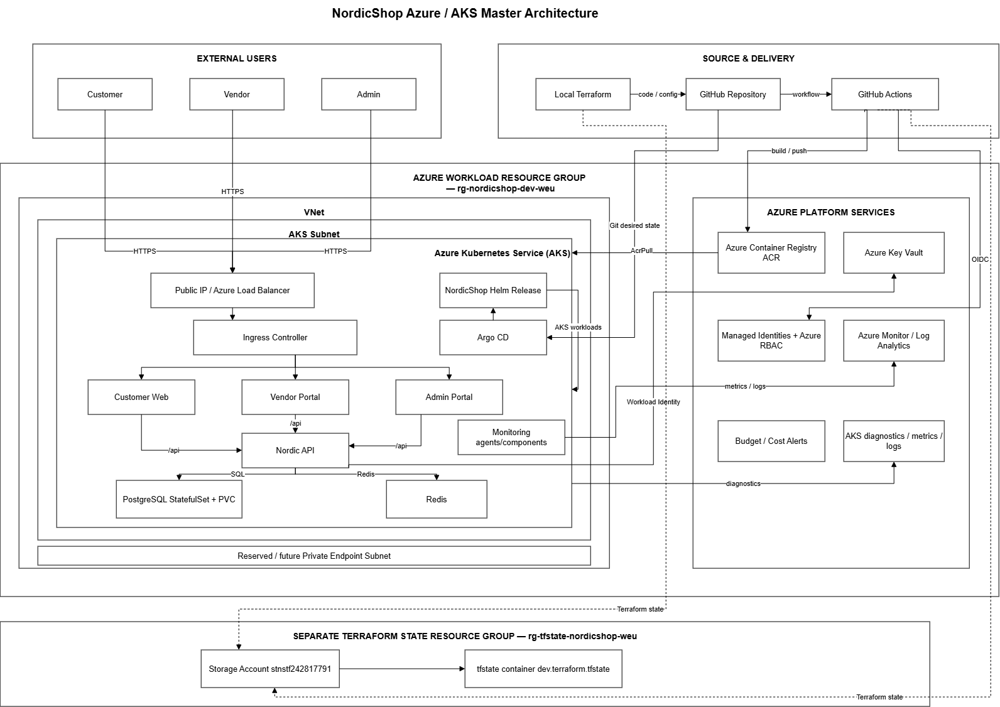

# NordicShop AKS Platform

NordicShop is a small multi-tenant marketplace that I built to learn and prove an Azure Kubernetes platform end to end.

The application itself is intentionally simple. The main work in this repository is the platform around it: Terraform, AKS, Helm, GitHub Actions, Argo CD, Workload Identity, Key Vault, monitoring, tenant isolation, security testing and recovery.

The development environment is built for Azure AKS in West Europe. Azure infrastructure is managed with Terraform, application workloads are packaged with Helm, and Argo CD keeps the cluster aligned with the desired state stored in Git.

## What this project demonstrates

The main things I wanted to prove with NordicShop are:

- Azure infrastructure managed with reusable Terraform modules
- AKS application delivery with Helm and Argo CD
- GitHub Actions authentication to Azure through OIDC
- container images published to ACR and deployed by immutable digest
- AKS Workload Identity for Nordic API access to Azure Key Vault
- clear separation between Terraform, Helm and Argo CD ownership
- API authorization plus PostgreSQL Row-Level Security for vendor isolation
- negative tenant-isolation testing across vendor boundaries
- PostgreSQL persistence and recovery with StatefulSet and PVC testing
- Git-based recovery from an invalid application image
- readiness, self-healing, monitoring and alert verification
- repeatable evidence for security and recovery tests

This is a portfolio and learning platform. I kept the application small so I could focus on the cloud and platform engineering around it.

## Architecture



The main request path is:

```text
Internet
   |
Azure Load Balancer / public entry point
   |
AKS Gateway / routing
   |
   +----------------+----------------+----------------+
   |                |                |
Customer Web    Vendor Portal    Admin Portal
   \                |                /
    \               |               /
             Nordic API
              /      \
             /        \
      PostgreSQL     Redis
```

The platform around the application includes:

```text
GitHub
  |
GitHub Actions
  |
Azure OIDC
  |
ACR
  |
image digest update in Git
  |
Argo CD
  |
Helm release
  |
AKS
```

Azure infrastructure is created separately with Terraform:

```text
Resource Group
├── VNet and subnets
├── AKS
├── Azure Container Registry
├── Key Vault
├── Managed Identities
├── Azure RBAC
├── Federated Identity Credentials
├── Log Analytics
├── Azure Monitor Workspace
├── Managed Grafana
├── diagnostics
└── budget controls
```

More detail is in [`docs/architecture/Architecture_Brief.md`](docs/architecture/Architecture_Brief.md).

## Application

NordicShop currently has six main workloads:

- `customer-web` — product catalogue, cart and checkout
- `vendor-portal` — tenant-scoped products, stock updates and order lines
- `admin-portal` — marketplace-wide admin views
- `nordic-api` — FastAPI backend
- `postgres` — persistent application data
- `redis` — cart and temporary shared state

The three frontends are small static applications served by Nginx. They call the shared FastAPI backend through `/api/*`.

The application is multi-tenant at the vendor layer. Vendor requests are scoped by tenant, and PostgreSQL Row-Level Security is also used so tenant isolation does not depend only on API filtering.

## Platform implementation

The repository contains the working platform and the evidence used to verify it.

### Azure and Terraform

The development environment is built from reusable Terraform modules under `infra/`.

The current Terraform layer covers:

- resource group
- networking
- AKS
- Azure Container Registry
- managed identities
- Azure RBAC
- Key Vault
- GitHub OIDC federation
- monitoring and diagnostics
- budget controls

Terraform state is kept outside the workload resource group in a separate Azure Storage backend.

### Kubernetes and Helm

The application is packaged as a Helm chart under:

```text
helm/nordicshop/
```

The chart manages the application Deployments and Services together with PostgreSQL, Redis, configuration, security objects and routing-related resources.

The earlier hand-written local Kubernetes manifests are still under `kubernetes/local/`. I kept them because they show the progression from direct Kubernetes YAML to the Helm-based deployment used by the AKS environment.

### Cilium NetworkPolicy status

The Helm chart contains NetworkPolicy definitions for the three frontends, Nordic API, PostgreSQL and Redis.

They are currently controlled through:

```yaml
networkPolicy:
  enabled: false
```

NetworkPolicy enforcement is intentionally disabled.

I planned to move the AKS cluster to Cilium before enabling these policies, but the Azure subscription did not have enough regional vCPU quota for the additional node capacity required during the networking upgrade. I left the existing networking configuration unchanged instead of forcing a partial or unsafe migration.

Because that migration is not complete, NordicShop does not claim active Kubernetes NetworkPolicy enforcement.

Before changing `networkPolicy.enabled` to `true`, I would verify:

- AKS has been migrated successfully to Cilium
- enough Azure regional vCPU quota and capacity are available for the upgrade
- Cilium is healthy
- Gateway-to-frontend and Gateway-to-API routing works
- Customer, Vendor and Admin application flows still work
- Nordic API can reach PostgreSQL and Redis
- required database jobs can reach PostgreSQL
- expected pod-to-pod paths are allowed
- denied-path tests confirm unwanted traffic is blocked
- smoke tests and tenant-isolation tests still pass

Until then, `networkPolicy.enabled` stays `false`.

### CI/CD and GitOps

GitHub Actions is used to build and publish the four custom application images.

The image workflow:

```text
source change
   |
GitHub Actions
   |
test and build
   |
Azure login with OIDC
   |
push images to ACR
   |
capture immutable digests
   |
update Helm values
   |
Git change / review
   |
Argo CD reconciliation
```

The AKS deployment uses immutable ACR digests rather than relying only on mutable tags.

Argo CD watches Git and reconciles the NordicShop Helm release. I intentionally keep image publishing and cluster reconciliation as separate responsibilities: GitHub Actions publishes artifacts, while Argo CD deploys the desired state from Git.

## Identity and secrets

I did not use one Azure identity for everything.

The main identity boundaries are:

- local Terraform identity
- GitHub Actions managed identity
- AKS cluster identity
- AKS kubelet identity
- Nordic API workload identity

GitHub Actions authenticates to Azure through OIDC instead of a stored Azure client secret.

The Nordic API uses AKS Workload Identity to reach Azure Key Vault:

```text
Nordic API Pod
   |
Kubernetes ServiceAccount
   |
projected service account token
   |
AKS OIDC issuer
   |
federated identity credential
   |
Nordic API managed identity
   |
Azure Key Vault
```

The kubelet identity has the ACR pull permission needed by the cluster. Application workloads do not reuse the kubelet or cluster identity for Key Vault access.

## PostgreSQL tenant isolation

Tenant isolation is enforced through API ownership checks and PostgreSQL RLS, with negative tests proving cross-tenant requests are denied in the tested application paths.

The API performs role, tenant and object-level authorization before database access.

PostgreSQL Row-Level Security provides an additional defence-in-depth layer for the vendor-owned `products` and `order_lines` tables. The API sets transaction-local PostgreSQL context such as `app.access_mode`, `app.tenant_id` and `app.order_id`, and the RLS policies use that context to restrict the rows available to the current request.

The application runtime database role, `nordicshop_app`, is intentionally restricted. It is not a superuser, cannot bypass RLS and receives only the table and column privileges required by the application.

RLS in this project is intended to protect against application query mistakes, such as a missing tenant filter. It is not treated as an independent authentication boundary against a compromised application process or an attacker who already has the runtime database credentials, because the trusted API is responsible for setting the PostgreSQL request context.

Customer checkout is allowed to decrement the `stock` column for products from multiple vendors because one order may contain items from more than one vendor. The runtime role has column-level permission only for `products.stock`; it cannot use this permission to modify protected product fields such as the product name or tenant ownership.

Production user authentication is intentionally outside the scope of this portfolio application. `X-Demo-User` selects seeded demonstration identities so the project can exercise vendor authorization, tenant isolation, administrator access and the surrounding AKS platform without building a production identity system.

## Monitoring and alerting

The AKS environment uses Azure Managed Prometheus and Azure Managed Grafana.

The repository includes three Grafana dashboards:

```text
monitoring/grafana/dashboards/
├── nordicshop-application.json
├── nordicshop-namespace-health.json
└── nordicshop-gitops-delivery.json
```

The current alert rules include:

- NordicShop API unavailable
- replica availability degraded
- Argo CD unhealthy
- high 5xx error rate

Alerts are connected to an Azure Monitor Action Group.

I also tested the alert path by creating a controlled GitOps drift condition. The Argo CD alert fired through Managed Prometheus and Azure Monitor and reached the configured email receiver.

## Security and recovery verification

I keep the detailed evidence under `docs/evidence/`, but these are the main results that matter.

| Check | Result |
| --- | --- |
| PostgreSQL RLS lab | 18 passed / 0 failed |
| AKS tenant isolation | 11 passed / 0 failed |
| Cross-vendor customer checkout | Passed |
| PostgreSQL outage recovery | 16 passed / 0 failed |
| Invalid API image GitOps recovery | Passed |
| PostgreSQL PVC persistence | Passed |
| Argo CD final state | Synced / Healthy |
| Managed alert delivery | Passed |

The final security and recovery summary is here:

[`docs/evidence/security-recovery/NordicShop_Security_and_Recovery_Acceptance.md`](docs/evidence/security-recovery/NordicShop_Security_and_Recovery_Acceptance.md)

## Recovery tests

I wanted the project to show what happens when something actually fails, not only that the happy path works.

### Invalid API image

For the image recovery test I committed a deliberately invalid Nordic API image reference.

The flow was:

```text
bad image in Git
   |
Argo CD detects the change
   |
AKS starts a new rollout
   |
image pull fails
   |
failure is detected
   |
Git revert
   |
Argo CD reconciles again
   |
original image is restored
```

The Deployment was not repaired manually with `kubectl set image`. Recovery happened through the Git desired state.

### PostgreSQL outage

For the database recovery test I scaled the PostgreSQL StatefulSet from `1` to `0`.

During the outage:

- the PostgreSQL Pod stopped
- the PVC stayed `Bound`
- API readiness returned `500`

After restoring PostgreSQL:

- `postgres-0` returned to `Ready`
- the same PVC remained attached
- order count stayed unchanged
- the latest order was still present
- API readiness returned to `200`
- Argo CD returned to `Synced / Healthy`

No PVC was deleted during the test.

## Known limitations

I keep these limitations explicit because this repository is meant to show the platform work that is actually implemented and tested.

- **Demo authentication:** `X-Demo-User` uses seeded demo identities. It is not a production authentication system. A real production application would use trusted identity tokens such as OIDC/JWT from an identity provider.
- **RLS trust boundary:** PostgreSQL RLS is defence in depth against application query mistakes. It does not protect against total compromise of the trusted API process or stolen runtime database credentials.
- **In-cluster data services:** PostgreSQL and Redis run inside AKS so I can demonstrate StatefulSets, PVCs, service discovery and dependency recovery. For a commercial production platform I would evaluate managed PostgreSQL and managed Redis services.
- **Public platform paths:** this development environment is not a fully private enterprise platform. Some Azure and AKS access paths remain public. A production design would evaluate private endpoints, tighter API-server access and other network controls according to the threat model.
- **NetworkPolicy enforcement:** the policy templates exist, but enforcement is currently disabled until the planned Cilium migration can be completed safely.
- **Production readiness:** NordicShop is a portfolio and learning platform. It demonstrates platform engineering patterns and tested failure scenarios, but it is not presented as a production-ready commercial marketplace.

## Repository layout

The main directories are:

```text
.
├── .github/workflows/          GitHub Actions
├── application/
│   ├── apps/                   three frontend applications
│   ├── database/               PostgreSQL security SQL
│   ├── services/nordic-api/    FastAPI backend
│   └── tests/                  application tests
├── docs/
│   ├── architecture/           architecture brief and diagrams
│   └── evidence/               verification records
├── gitops/                     Argo CD configuration
├── helm/nordicshop/            Helm chart used by AKS
├── infra/
│   ├── bootstrap/              reserved placeholder; remote state backend was bootstrapped separately
│   ├── environments/dev/       development root module
│   └── modules/                reusable Azure modules
├── kubernetes/local/           earlier local Kubernetes manifests
├── monitoring/                 Grafana dashboards and alert notes
├── scripts/                    verification/helper scripts
└── tests/
    ├── aks/                    AKS functional and recovery tests
    └── security/               RLS, tenant isolation and recovery tests
```

## Running locally

The full local stack can be started with Docker Compose:

```bash
docker compose up -d
```

Check the services:

```bash
docker compose ps
```

Useful local endpoints are:

```text
Customer Web   http://localhost:8081
Vendor Portal  http://localhost:8082
Admin Portal   http://localhost:8083
Nordic API     http://localhost:8000
API docs       http://localhost:8000/docs
```

Stop the stack with:

```bash
docker compose down
```

The PostgreSQL named volume is intentionally kept unless volumes are explicitly removed.

## Application tests

From the repository root:

```bash
python3 -m venv .venv
source .venv/bin/activate

python -m pip install -r application/services/nordic-api/requirements.txt
python -m pytest -q application/tests
```

## Helm checks

Validate the chart:

```bash
helm lint helm/nordicshop
```

Render the development configuration:

```bash
helm template nordicshop helm/nordicshop \
  --namespace nordicshop \
  -f helm/nordicshop/values-dev.yaml
```

There is also a local verification script:

```bash
./scripts/verify-helm-local.sh
```

## Terraform checks

The development environment is under:

```text
infra/environments/dev/
```

A normal validation flow is:

```bash
cd infra/environments/dev

terraform fmt -recursive ../../
terraform validate
terraform plan
```

I do not keep `terraform.tfvars`, state files or plan files in Git.

The Terraform modules are intentionally split by responsibility rather than putting all Azure resources into one large file.

## AKS checks

When the development cluster is running, these are the checks I use most often:

```bash
kubectl get nodes
kubectl get pods -n nordicshop
kubectl get pvc -n nordicshop
kubectl get application nordicshop -n argocd
```

After a successful reconciliation I expect the NordicShop Argo CD application to end at:

```text
Synced   Healthy
```

The security and recovery tests are under:

```text
tests/security/
```

For example:

```bash
./tests/security/tenant-isolation-aks.sh
./tests/security/invalid-api-image-recovery.sh
./tests/security/postgres-outage-recovery.sh
```

The recovery scripts intentionally make changes to the live development environment. I only run them against the dev cluster and with a clean baseline.

## Design choices

A few decisions in this repository are deliberate compromises because this is a single-engineer project and a learning environment.

PostgreSQL and Redis are currently inside AKS. That gives me direct experience with StatefulSets, PVCs, service discovery and dependency recovery. For a commercial production system I would seriously consider Azure Database for PostgreSQL and a managed Redis service instead.

The AKS environment is not designed as a fully private enterprise platform. The network layout keeps room for future private endpoints, but I did not add Private Link everywhere just to make the diagram more complicated.

I also kept the application small on purpose. Splitting the backend into many microservices would add operational work without helping the main goal of this repository, which is learning and proving the platform layer.

The project has changed a lot while I built it, so some older local manifests and test assets remain in the repository when they still explain the path to the current design. I remove intermediate notes and duplicate evidence when they no longer add anything useful.

## Current state

The platform has been built and verified end to end through this path:

```text
Terraform
   |
Azure infrastructure
   |
AKS
   |
Helm
   |
Argo CD
   |
NordicShop workloads
   |
Managed Prometheus / Grafana
```

The main security, tenant-isolation, GitOps recovery, PostgreSQL persistence and alert-delivery checks have also been completed and recorded under `docs/evidence/`.

There is still more I can harden later—backup strategy, stricter production networking, branch protection, additional policy controls and a fuller production-readiness review—but I prefer to keep those as explicit next steps rather than claim they are already solved.
